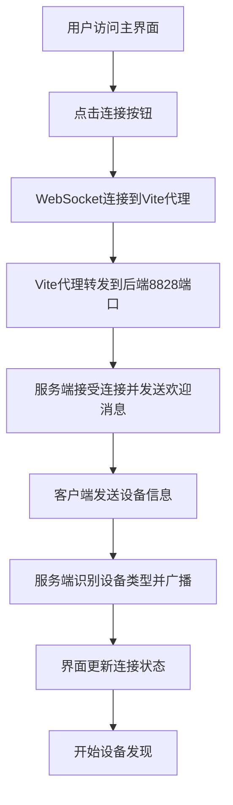
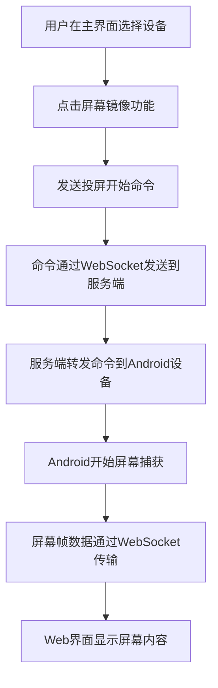
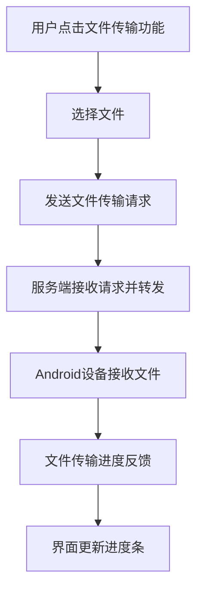

# Windows-Android Connect 服务端架构与界面关系文档

## 1. 系统架构概述

Windows-Android Connect 采用前后端分离的架构设计，主要包含以下几个核心组件：

### 核心服务组件
1. **Windows主服务** - 运行在端口8828，负责WebSocket通信和设备发现
2. **Vite开发服务器** - 运行在端口8080，提供Web前端界面和代理服务
3. **Android客户端** - 通过WiFi连接到Windows服务端
4. **Web客户端** - 通过浏览器访问Vite服务器提供的界面

### 架构图
```
┌─────────────────┐    UDP广播    ┌──────────────────┐
│   Android设备   │ ◄───────────► │  Windows服务端   │
│                 │               │  (端口8828)      │
└─────────────────┘               └──────────────────┘
                                         │
                                         │ WebSocket
                                         ▼
                              ┌──────────────────┐
                              │   Vite服务器     │
                              │  (端口8080)      │
                              └──────────────────┘
                                         │
                                         │ HTTP/WS
                                         ▼
                              ┌──────────────────┐
                              │   Web浏览器      │
                              │   (用户界面)     │
                              └──────────────────┘
```

## 2. 服务端架构详解

### 2.1 Windows主服务 (端口8828)
文件: `integrated-vite-server.js`

#### 核心功能
- **WebSocket服务器**: 处理所有设备间的实时通信
- **UDP设备发现服务**: 在端口8090上广播和接收设备发现消息
- **HTTP API服务**: 提供状态查询、日志查看等RESTful接口
- **消息路由**: 在不同客户端间转发消息

#### 主要模块
1. **Express HTTP服务器**: 提供静态文件服务和API接口
2. **WebSocket服务器**: 处理设备连接和消息传递
3. **UDP发现服务**: 实现局域网设备自动发现
4. **客户端管理**: 维护所有连接客户端的状态
5. **消息处理器**: 根据消息类型处理各种功能请求

### 2.2 Vite开发服务器 (端口8080)
文件: `vite-config.js`

#### 核心功能
- **前端开发服务器**: 提供热重载和实时编译
- **静态资源服务**: 提供HTML、CSS、JS等前端资源
- **代理服务**: 将WebSocket和API请求代理到后端服务
- **多页面支持**: 支持多个入口页面

#### 构建配置
- **入口文件**: 
  - `index.html` - 主React应用页面
  - `test-ui.html` - 测试页面
  - `screen-stream.html` - 屏幕投屏页面
- **代理配置**:
  - `/ws` → `ws://localhost:8828` (WebSocket代理)
  - `/api` → `http://localhost:8828` (API代理)

## 3. 可访问界面及功能

### 3.1 主React应用界面
**访问地址**: `http://localhost:8080` 或 `http://localhost:8080/index.html`
**文件**: `index.html` + `src/App.jsx`

#### 功能特性
- 设备连接状态显示
- 设备发现和连接管理
- 文件传输功能入口
- 屏幕镜像功能入口
- 远程控制功能入口
- 剪贴板同步功能入口
- 通知同步功能入口

#### 页面结构
```
┌─────────────────────────────────────────────┐
│ Windows-Android Connect 主界面              │
├─────────────────────────────────────────────┤
│ 连接状态区域                                │
│  - 连接/断开连接按钮                        │
│  - 连接状态指示器                          │
├─────────────────────────────────────────────┤
│ 已连接设备列表                              │
│  - 设备信息显示                            │
├─────────────────────────────────────────────┤
│ 功能选项网格                                │
│  - 文件传输 📁                              │
│  - 屏幕镜像 📱                              │
│  - 远程控制 🎮                              │
│  - 剪贴板同步 📋                            │
│  - 通知同步 🔔                              │
│  - 安全连接 🔒                              │
├─────────────────────────────────────────────┤
│ 应用信息区域                                │
│  - 服务端状态                              │
│  - 应用版本信息                            │
│  - 连接协议信息                            │
└─────────────────────────────────────────────┘
```

### 3.2 屏幕投屏界面
**访问地址**: `http://localhost:8080/screen-stream.html`
**文件**: `screen-stream.html`

#### 功能特性
- 设备连接状态监控
- Android设备信息显示
- 屏幕投屏显示区域
- 设备控制按钮
- 文件传输进度显示
- 系统日志查看

#### 页面结构
```
┌─────────────────────────────────────────────┐
│ Windows-Android Connect 屏幕投屏界面        │
├─────────────────────────────────────────────┤
│ 连接状态栏                                  │
│  - 连接状态信息                            │
├─────────────────────────────────────────────┤
│ 设备列表                                    │
│  - Android设备卡片                         │
│  - Windows设备卡片                         │
├─────────────────────────────────────────────┤
│ 控制面板                                    │
│  - 设备控制 (连接/断开)                    │
│  - 文件传输 (发送/接收)                    │
│  - 远程控制 (鼠标/键盘模式)                │
│  - 同步功能 (剪贴板/通知)                  │
├─────────────────────────────────────────────┤
│ 屏幕显示区域                                │
│  - 屏幕投屏画布                            │
│  - 投屏控制按钮                            │
├─────────────────────────────────────────────┤
│ 系统日志区域                                │
│  - 实时日志输出                            │
└─────────────────────────────────────────────┘
```

### 3.3 测试界面
**访问地址**: `http://localhost:8080/test-ui.html`
**文件**: `test-ui.html`

#### 功能特性
- WebSocket连接测试
- 设备发现功能测试
- 文件传输功能测试
- 屏幕投屏功能测试
- 远程控制功能测试

#### 页面结构
```
┌─────────────────────────────────────────────┐
│ Windows-Android Connect 测试界面            │
├─────────────────────────────────────────────┤
│ 服务器连接状态                              │
│  - 连接/断开按钮                           │
├─────────────────────────────────────────────┤
│ 设备发现测试                                │
│  - 开始/停止发现按钮                       │
│  - 刷新设备列表按钮                        │
│  - 设备列表显示                            │
├─────────────────────────────────────────────┤
│ 功能测试区域                                │
│  - 文件传输测试按钮                        │
│  - 屏幕投屏测试按钮                        │
│  - 远程控制测试按钮                        │
└─────────────────────────────────────────────┘
```

### 3.4 服务端功能测试界面
**访问地址**: `http://localhost:8080/test-server-functions.html`
**文件**: `test-server-functions.html`

#### 功能特性
- 服务器状态检查
- WebSocket连接测试
- 自定义消息发送
- 设备发现控制
- 控制命令测试
- 日志查看功能

#### 页面结构
```
┌─────────────────────────────────────────────┐
│ 服务端功能测试界面                          │
├─────────────────────────────────────────────┤
│ 服务器状态显示                              │
├─────────────────────────────────────────────┤
│ WebSocket连接控制                           │
│  - 连接/断开按钮                           │
│  - 测试消息发送                            │
├─────────────────────────────────────────────┤
│ 设备发现控制                                │
│  - 开始/停止发现按钮                       │
│  - 获取设备列表按钮                        │
├─────────────────────────────────────────────┤
│ 消息发送区域                                │
│  - 自定义消息类型选择                      │
│  - 消息内容输入                            │
│  - 目标设备指定                            │
│  - 控制命令类型选择                        │
├─────────────────────────────────────────────┤
│ 发现设备列表                                │
├─────────────────────────────────────────────┤
│ 日志输出区域                                │
│  - 实时日志显示                            │
└─────────────────────────────────────────────┘
```

## 4. 页面跳转逻辑与工作流

### 4.1 主要工作流

#### 设备连接工作流


#### 屏幕投屏工作流


#### 文件传输工作流


### 4.2 页面间跳转关系

目前系统中各页面相对独立，没有直接的跳转链接，但可以通过以下方式访问不同页面：

1. **从主界面访问其他页面**:
   - 直接修改URL访问不同页面
   - 通过书签或历史记录访问

2. **功能测试入口**:
   - `test-ui.html` - 基础功能测试
   - `test-server-functions.html` - 服务端功能测试
   - `screen-stream.html` - 屏幕投屏专用界面

## 5. 通信协议与数据格式

### 5.1 WebSocket消息格式
所有WebSocket通信使用JSON格式消息：

```json
{
  "type": "消息类型",
  "其他字段": "根据消息类型定义"
}
```

### 5.2 主要消息类型

#### 客户端→服务端
- `device_info`: 设备信息注册
- `start_device_discovery`: 开始设备发现
- `stop_device_discovery`: 停止设备发现
- `get_discovered_devices`: 获取设备列表
- `control_command`: 控制命令
- `file_transfer`: 文件传输
- `clipboard`: 剪贴板同步
- `notification`: 通知消息
- `heartbeat`: 心跳包

#### 服务端→客户端
- `connection_established`: 连接建立确认
- `device_found`: 发现新设备
- `device_connected`: 设备连接确认
- `android_connected`: Android设备连接
- `android_disconnected`: Android设备断开
- `screen_frame`: 屏幕帧数据
- `file_transfer`: 文件传输状态
- `clipboard`: 剪贴板数据
- `notification`: 通知数据
- `heartbeat`: 心跳响应
- `error`: 错误消息

## 6. 部署与启动

### 6.1 启动脚本
- `start-both-servers.bat`: 同时启动主服务和Vite开发服务器
- `integrated-vite-server.js`: 集成服务端，包含主服务和Vite服务器
- `npm run dev:vite`: 启动独立的Vite开发服务器

### 6.2 访问地址
- **主应用界面**: http://localhost:8080
- **屏幕投屏界面**: http://localhost:8080/screen-stream.html
- **测试界面**: http://localhost:8080/test-ui.html
- **服务端测试**: http://localhost:8080/test-server-functions.html
- **后端API**: http://localhost:8828
- **WebSocket**: ws://localhost:8080/ws (通过代理) 或 ws://localhost:8828 (直连)

## 7. 总结

Windows-Android Connect 的服务端架构采用了现代化的前后端分离设计，通过Vite开发服务器提供多页面的Web界面，并通过代理机制解决了开发环境下的跨域问题。系统支持多种功能界面，满足不同场景下的使用需求，具有良好的扩展性和维护性。