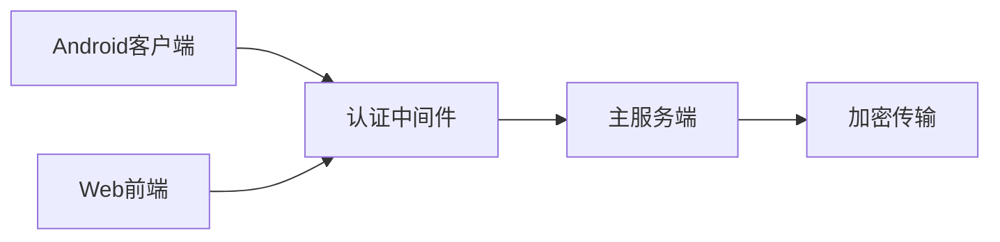
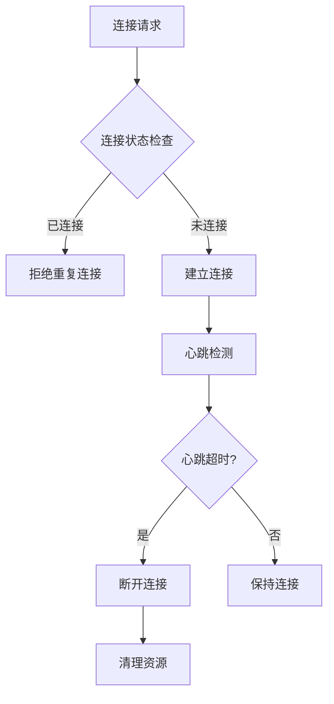

# Windows-Android Connect 系统架构合理性分析与改进建议

## 当前架构概述

当前系统采用三层架构：
- **服务端**：complete-server.js (8828端口 WebSocket, 8090端口 UDP)
- **开发代理层**：Vite (3000端口 HTTP/WS 代理)
- **客户端**：Android客户端和Web前端

## 架构合理性分析

### ✅ 合理之处

1. **分层设计合理**：
   - 服务端负责核心业务逻辑和消息转发
   - Vite提供开发便利性，代理请求到后端
   - 前后端分离，职责清晰

2. **通信协议适配**：
   - WebSocket用于实时双向通信
   - UDP用于设备发现，避免TCP连接开销
   - 端口分配合理，避免冲突

3. **功能模块化**：
   - 设备发现、文件传输、屏幕镜像等功能模块化
   - 消息类型分类清晰，便于扩展

4. **代理机制**：
   - Vite代理将3000端口请求转发到8828端口，简化前端连接配置

### ⚠️ 可改进之处

1. **安全性**：
   - 缺乏身份验证机制
   - 数据传输未加密
   - 仅依赖局域网隔离

2. **错误处理**：
   - 客户端连接失败处理机制简单
   - 断线重连机制不够完善

3. **可扩展性**：
   - 硬编码的IP地址配置
   - 单服务器架构，无法支持多设备并发

## 改进建议

### 1. 安全性增强

- 实现设备认证机制
- 增加数据传输加密
- 实现IP白名单机制

### 2. 连接管理优化

- 实现断线自动重连
- 完善心跳检测机制
- 优化连接状态管理

### 3. 配置中心化
- 将端口配置、服务器地址等参数外部化
- 实现动态配置更新
- 提供配置验证机制

### 4. 负载均衡考虑
- 支持多服务器部署
- 实现设备连接负载均衡
- 提供高可用性保障

## 架构演进建议

### 短期改进（1-2周）
1. 修复硬编码IP地址问题
2. 增强错误处理和日志记录
3. 完善断线重连机制

### 中期改进（1-2月）
1. 添加基础认证机制
2. 实现配置管理模块
3. 优化设备发现算法

### 长期改进（3-6月）
1. 实现微服务架构
2. 添加数据加密传输
3. 实现分布式部署支持

## 总结

当前架构基本合理，满足了Windows-Android连接的基本需求。Vite代理机制很好地解决了开发环境下的跨域问题。主要改进方向是增强安全性和可靠性，这需要在后续版本中逐步完善。