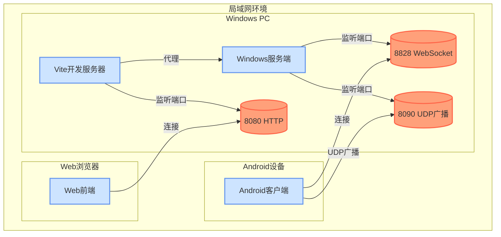
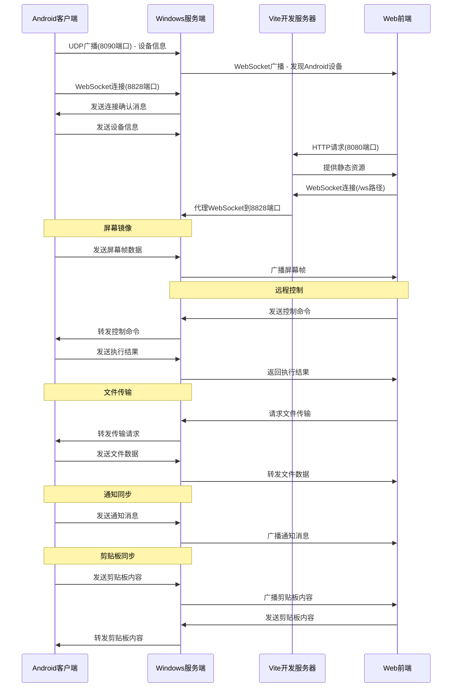
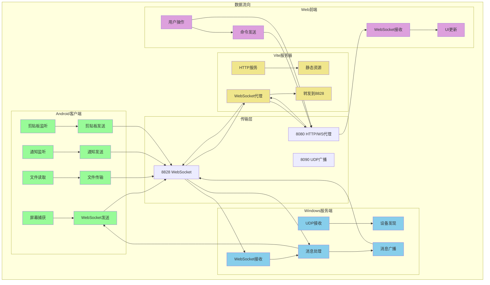

# Windows-Android Connect 系统架构图

## 架构总览

## 详细组件交互

## 数据流向图

## 端口配置说明

| 组件 | 端口 | 协议 | 用途 |
|------|------|------|------|
| Windows主服务 | 8828 | WebSocket | 客户端连接和消息处理 |
| 设备发现服务 | 8090 | UDP | 局域网内设备自动发现 |
| Vite开发服务器 | 8080 | HTTP/WS | Web前端访问和代理 |

## 连接关系

1. **Android客户端** ↔ **Windows服务端** (8828端口 WebSocket)
2. **Android客户端** ↔ **Windows服务端** (8090端口 UDP广播)
3. **Web前端** ↔ **Vite服务器** (8080端口 HTTP/WS)

4. **Vite服务器** ↔ **Windows服务端** (代理到8828端口)